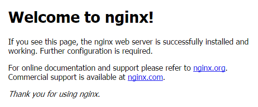
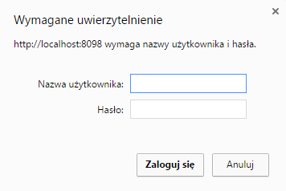

# poc-nginx

## Cel

1. uruchomienie nginx w kontenerze

2. wystawienie statycznej strony www

3. nginx jako reverse proxy

4. nginx jako load balancer

5. ograniczenie dostępu do zasobu

## 1. Uruchomienie nginx w kontenerze

Utworzenie podstawowego kontenerka o nazwie nginx-t01 na podstawie obrazu nginx z ekspozycją portu 80 na porcie 8080

`docker run --name nginx-t01 -d -p 8080:80 nginx`

Chcielibyśmy jednak aby konfiguracja nginx była trzymana na hoście.

`docker run --name nginx-t02 -p 8082:80 -v C:/poc/.docker/nginx.conf:/etc/nginx/nginx.conf:ro -d nginx`

gdzie wskazujemy konfiguracja na *C:/poc/.docker/nginx.conf*

Po uruchomieniu w przeglądarce strony *localhost:8082*, pojawi się ekran powitalny nginx-a

Aby pozyskać przykładowy plik konfiguracyjny możesz go skopiować ze strony nginx, lub z kontenera. Poniżej skopiowanie konfiguracji z przykładowego kontenera tmp-container

`docker run --name tmp-container -d nginx`

`docker cp tmp-container:/etc/nginx/nginx.conf C:/poc/.docker/nginx.conf`

`docker rm --force tmp-container`

Poniżej przykładowo konfiguracja pozyskana w sposób opisany powyżej

    user  nginx;
	worker_processes  1;

	error_log  /var/log/nginx/error.log warn;
	pid        /var/run/nginx.pid;

	events {
		worker_connections  1024;
	}

	http {
		include       /etc/nginx/mime.types;
		default_type  application/octet-stream;

		log_format  main  '$remote_addr - $remote_user [$time_local] "$request" '
						  '$status $body_bytes_sent "$http_referer" '
						  '"$http_user_agent" "$http_x_forwarded_for"';

		access_log  /var/log/nginx/access.log  main;

		sendfile        on;
		#tcp_nopush     on;

		keepalive_timeout  65;

		#gzip  on;

		include /etc/nginx/conf.d/*.conf;
	}
	
Uruchomienie basha w powyższym kontenerze nginx-t02

`docker exec -i -t nginx-t02 /bin/bash`

Opcje -i i -t pozwalają na odpalenie pseudoterminala (pseudo-tty)

więcej o docker exec na [https://docs.docker.com/engine/reference/commandline/exec/](https://docs.docker.com/engine/reference/commandline/exec/).

Wylistowanie uruchomionych kontenerów

`docker ps -a`

Aby zatrzymać kontener:

`docker stop nginx-t02`

## 2. Wystawienie statycznej strony www przy użyciu nginx

Zacznijmy od zdefiniowania volumenów dla kontenera, mapując porty 80 z kontenera na 8081 i 8080 z kontenera na 8082, opcja –rm usunie kontener jeżeli już isntieje

`docker run --rm --name nginx-t03 -p 8081:80 -p 8082:8080 -v C:/poc/.docker/nginx.conf:/etc/nginx/nginx.conf:ro -v C:/poc/public_html:/usr/share/nginx/html:ro -d nginx`

Skoro utworzyliśmy już kontener nginx-a, przejdźmy do konfiguracji

	user nginx;
	worker_processes 1;

	error_log  /var/log/nginx/error.log info;
	pid        /var/run/nginx.pid;

	events {
		worker_connections 1024;
	}

	http {
		include       /etc/nginx/mime.types;
		default_type  application/octet-stream;

		log_format  main  '$remote_addr - $remote_user [$time_local] "$request" '
						  '$status $body_bytes_sent "$http_referer" '
						  '"$http_user_agent" "$http_x_forwarded_for"';

		access_log  /var/log/nginx/access.log  main;

		sendfile        on;
		#tcp_nopush     on;

		keepalive_timeout  65;
		
			#mozemy zdefiniowac dla calego kontektstu http
		index index.php index.htm index.html;
		
		#strona 1
		server {
			listen       80;

					#domyslny root dla wszystkich lokalizacji w kontekscie tego serwera
			root /usr/share/nginx/html/page1/;
			
					location / {
				try_files $uri $uri/ =404;
			}
			location /images/ {
							#wylistowanie plikow wlaczone w tej lokalizacji
				autoindex on;
			}
		}
		
		#strona 2
		server {
			listen       8080;
			root /usr/share/nginx/html/page2/;
			location / {
				try_files $uri $uri/ =404;
			}
			location /images/ {
				autoindex on;
			}
		}
	}
	
Kolejne zmiany konfiguracji wymagają restartu nginxa

`docker restart nginx-t03`

Tworząc kontener nginx podpięliśmy volumen *C:/poc/.docker/public_html* jako */usr/share/nginx/html/*, więc w naszej konfiguracji nginxa posługujemy się właśnie lokalizacją */usr/share/nginx/html/* jako root

Poniżej struktura katalogów

	├───page1
	│   │   index.html
	│   │
	│   └───images
	│           face.png
	│
	└───page2
		│   index.html
		│
		└───images
				face.png
				
gdzie index.html z katalogów pageX przedstawiają się następująco

[http://localhost:8081/](http://localhost:8081/) – strona1

[http://localhost:8082/](http://localhost:8082/) – strona2

## 3. Nginx jako reverse proxy

Jedną z podstawowych zalet proxy jest możliwość skalowania infrastruktury. Nginx jest w stanie obsługiwać wiele połączeń jednocześnie (patrz c10k), co czyni z niego idealne narzędzie do kontaktu z klientem.

Tworzymy sobie kolejny kontener

`docker run -it --rm --name nginx-t04 -p 8091:80 -p 8092:8080 -p 8093:8070 -v C:/poc/.docker/nginx.conf:/etc/nginx/nginx.conf:ro -v C:/poc/public_html:/usr/share/nginx/html:ro -d nginx`

W naszym prostym przykładnie obrazki (/images) będą serwowane z ze strony wystawionej na porcie 8093, a strona *localhost:8093* będzie proxowana na *localhost:8092*, więc w rezultacie powinniśmy zobaczyć kontent 2 z obrazkiem z 1. Powyższe numery portów są portami widocznymi z maszyny hosta, dla przypomnienia
mapowanie w kontenerze: 8091->80,8092->8080, 8093->8070 (patrz powyżej)

Konfiguracja (najważniejsza część)

	index index.php index.htm index.html;

	#page1
	server {
		listen       80;
		root /usr/share/nginx/html/page1/;
		location / {
			try_files $uri $uri/ =404;
		}
		location /images/ {
			autoindex on;
		}
	}

	#page2
	server {
		listen       8080;
		root /usr/share/nginx/html/page2/;
		location / {
			try_files $uri $uri/ =404;
		}
		location /images/ {
			autoindex on;
		}
	}

	#page1 proxy
	server {
		listen       8070;
		root /usr/share/nginx/html/page1/;
		location / {
					#czyli page 2
			proxy_pass http://localhost:8080/;
		}
		location /images/ {
			autoindex on;
		}
	}

Poniżej rezultat wejścia na *localhost:9093*

Przy proxowaniu requestu należy jednak pamiętać o specyficznej obsłudze nagłówków przez nginx. Więcej na [https://www.nginx.com/resources/admin-guide/reverse-proxy/](https://www.nginx.com/resources/admin-guide/reverse-proxy/)

## 4. Nginx jako load balancer

Jako przykład uruchomimy 3 maszyny kolejno na portach 8095,8096 i 8097, przy czym maszyna na porcie 8097 będzie rozrzucała ruch na 8095 i 8096.

`docker run -it --rm --name nginx-t05 -p 8095:8095 -p 8096:8096 -p 8097:8097 -v C:/poc/.docker/nginx.conf:/etc/nginx/nginx.conf:ro -v C:/poc/public_html:/usr/share/nginx/html:ro -d nginx`

Poniżej konfiguracja nginx (wewnątrz kontekstu http)

	index index.php index.htm index.html;

	upstream backend_hosts {
		server localhost:8095;
		server localhost:8096;
	}

	#page1
	server {
		listen       8095;
		root /usr/share/nginx/html/page1/;
		location / {
			try_files $uri $uri/ =404;
		}
		location /images/ {
			autoindex on;
		}
	}

	#page2
	server {
		listen       8096;
		root /usr/share/nginx/html/page2/;
		location / {
			try_files $uri $uri/ =404;
		}
		location /images/ {
			autoindex on;
		}
	}

	#proxy
	server {
		listen       8097;
		location / {
			proxy_pass http://backend_hosts;
		}
	}

Po wejściu na *localhost:8097* kolejno na zmianę pokazują się strony 1,2.Dzieje się tak ponieważ domyślnym algorytmem load balancingu w nginx jest round-robin.

Pozostałe obsługiwane sposoby balancingu:

+ least_conn

+ ip_hash

+ hash

Dodatkowo podczas balancingu można użyć wagi dla danego serwera

	upstream backend_hosts {
			server localhost:8095 weight=3;
			server localhost:8096;
		}
		
Więcej na [https://www.nginx.com/resources/admin-guide/load-balancer/](https://www.nginx.com/resources/admin-guide/load-balancer/)

## 5. Ograniczenie dostępu do zasobu

Tworzymy wpis dla użytkownika testowy, jako hasło podajemy JakiesHaslo

`htpasswd -c /tmp/.htpasswd testowy`

W wyniku czego powstaje plik */tmp/.htpasswd* o zawartości

	testowy:$apr1$4f7ImKCe$t2z/wcGQK7zY.VnzRlFE01
	
Jeżeli nie posiadasz httpasswd, utwórz maszynę

`docker run -it --rm --name httpd-t02 -p 8080:80 -d httpd`

Tworzymy sobie kolejną maszynę

`docker run -it --rm --name nginx-t07 -p 8098:8098 -v C:/poc/.docker/nginx.conf:/etc/nginx/nginx.conf:ro -v C:/poc/public_html:/usr/share/nginx/html:ro -d nginx`

wewnątrz maszyny tworzymy plik /usr/share/nginx/htpasswd z zawartością .htpasswd

kolejno wskazujemy w serwerze

	server {
		listen       8098;
		auth_basic           "Strefa chroniona";
		auth_basic_user_file /usr/share/nginx/htpasswd;

		root /usr/share/nginx/html/page2/;
		location / {
			try_files $uri $uri/ =404;
		}
	}
	
Po wejściu na [http://localhost:8098/](http://localhost:8098/) otrzymujemy 

więcej na [https://www.nginx.com/resources/admin-guide/restricting-access-auth-basic/](https://www.nginx.com/resources/admin-guide/restricting-access-auth-basic/)

## Linki

[https://nginx.org/en/docs/](https://nginx.org/en/docs/)

[https://www.nginx.com/resources/wiki/start/topics/tutorials/config_pitfalls/](https://www.nginx.com/resources/wiki/start/topics/tutorials/config_pitfalls/)

[https://www.digitalocean.com/community/tutorials/understanding-nginx-http-proxying-load-balancing-buffering-and-caching](https://www.digitalocean.com/community/tutorials/understanding-nginx-http-proxying-load-balancing-buffering-and-caching)

